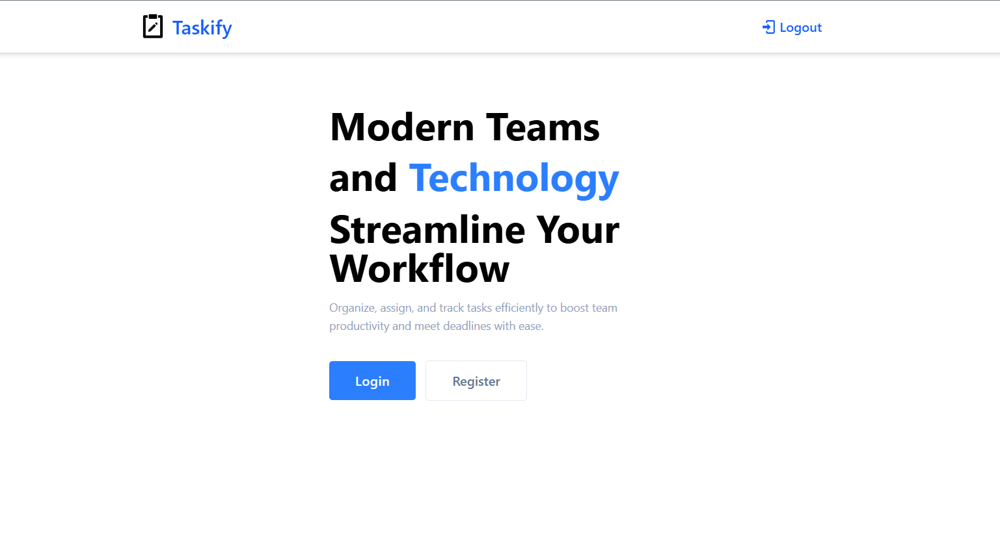
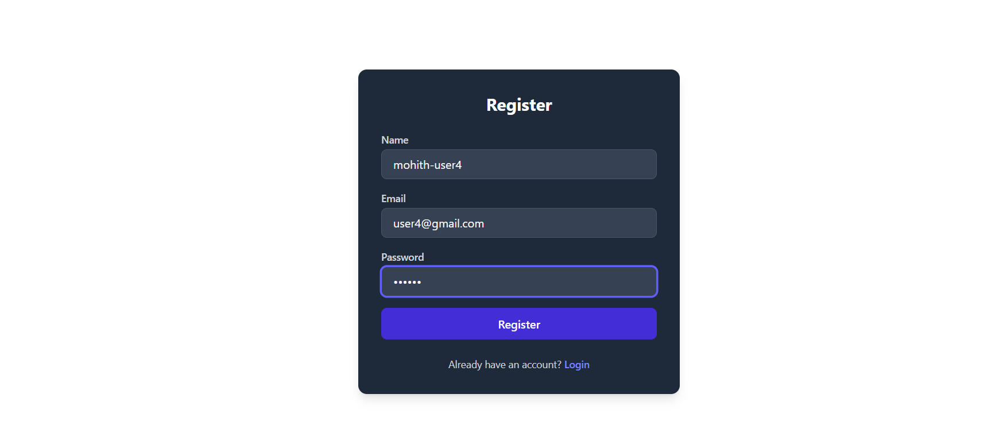
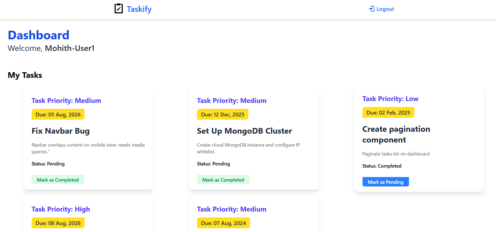
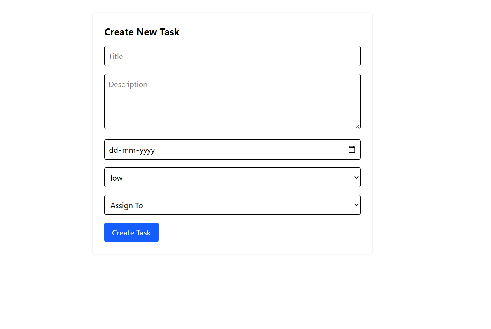
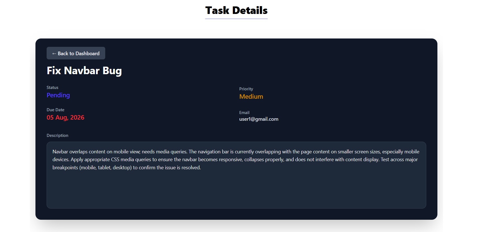

# 📝 Taskify

A full-stack Task Management Web App built with the **MERN stack** (MongoDB, Express.js, React, Node.js), featuring:

- ✅ User authentication (JWT-based)
- 📋 Create, update, and delete tasks (Authorised)
- 🧑‍🤝‍🧑 Assign tasks to users
- 🚦 Task priority levels (High, Medium, Low)
- 📊 Task status toggle (Pending/Completed)
- 🗂️ Redux Toolkit for state management
- 🎨 Tailwind CSS for styling

---

## 🔗 Live Demo
[🔗 Click here to view the live app]

---

## 📸 Screenshots








---

## 🛠️ Tech Stack

**Frontend:**
- React
- Redux Toolkit
- React Router DOM
- Tailwind CSS
- Axios
- JWT Decode

**Backend:**
- Node.js
- Express.js
- MongoDB
- Mongoose
- Bcrypt
- JSON Web Token (JWT)
- CORS, Dotenv

---

## 📂 Project Structure

```
task-app/
├── backend/
│ ├── controllers/
│ ├── models/
│ ├── config/
│ ├── routes/
│ ├── middleware/
│ ├── app.js
│ └── server.js
├── frontend/
│ └── src/
│ ├── layout/
│ ├── pages/
│ ├── helpers/
│ ├── constants/
│ ├── components/
│ ├── redux/
│ ├── api/
│ ├── App.jsx
│ └── main.jsx
└── README.md
```

---

## 🚀 Features

- 👤 User Registration & Login
- 🔐 Protected Routes (via JWT)
- 📁 Task CRUD operations
- 👥 Assign tasks to users
- 🎨 Responsive UI with Tailwind CSS
- 🛎️ Toast notifications for actions

---

## 🧪 API Endpoints

### 🔐 Auth

| Method | Route        | Description          |
|--------|--------------|----------------------|
| POST   | `/api/auth/register` | Register new user |
| POST   | `/api/auth/login`    | Login existing user |

### 📋 Tasks

| Method | Route         | Description               |
|--------|---------------|---------------------------|
| GET    | `/api/tasks`  | Get all tasks             |
| POST   | `/api/tasks`  | Create new task           |
| PUT    | `/api/tasks/:id` | Update task by ID      |
| DELETE | `/api/tasks/:id` | Delete task by ID      |

### 👥 Users

| Method | Route         | Description               |
|--------|---------------|---------------------------|
| GET    | `/api/users`  | Get all users (for assigning) |

---

## ⚙️ Setup Instructions

### 📁 Backend

```bash
cd backend
npm install
npm run dev
```

Create a `.env` file inside `/backend`:

```env
PORT=5000
MONGO_URI=your_mongo_connection_string
JWT_SECRET=your_secret_key
JWT_EXPIRY=your_expiry
FRONTEND_URL=http://localhost:5173
```

### 🌐 Frontend

```bash
cd frontend
npm install
npm run dev
```

Create a `.env` file inside `/frontend`:

```env
VITE_API_URL=http://localhost:5000/api
```

---

## 🧠 Learnings & Concepts

- How to use **Redux Toolkit** effectively for scalable state management
- Secure JWT authentication with **protected routes**
- Efficient backend routing and validation with Express + Mongoose
- Full CRUD with React + Tailwind responsive UI
- Reusable components and toast notifications with `react-toastify`

---

